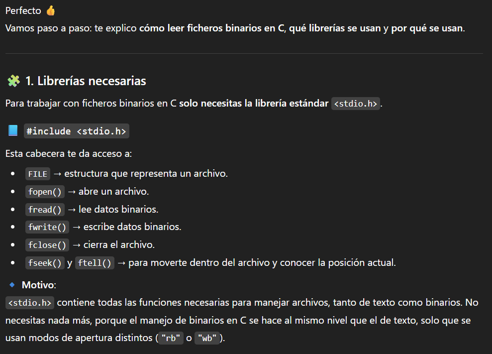
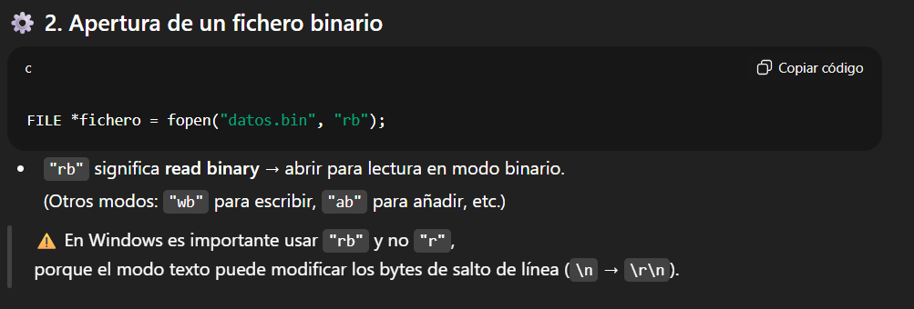
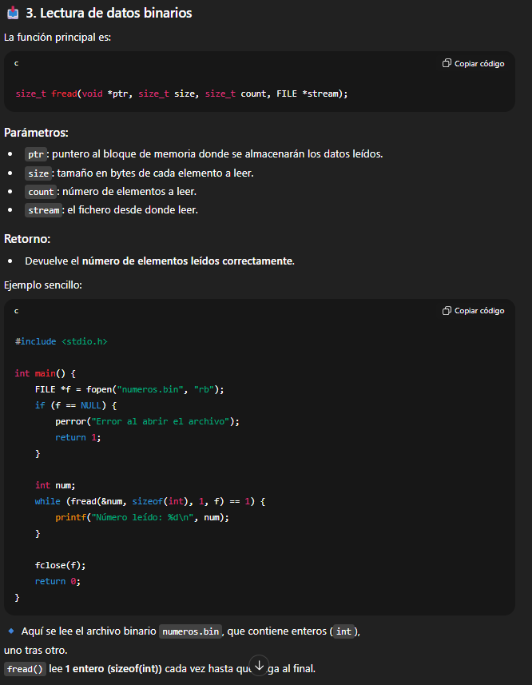
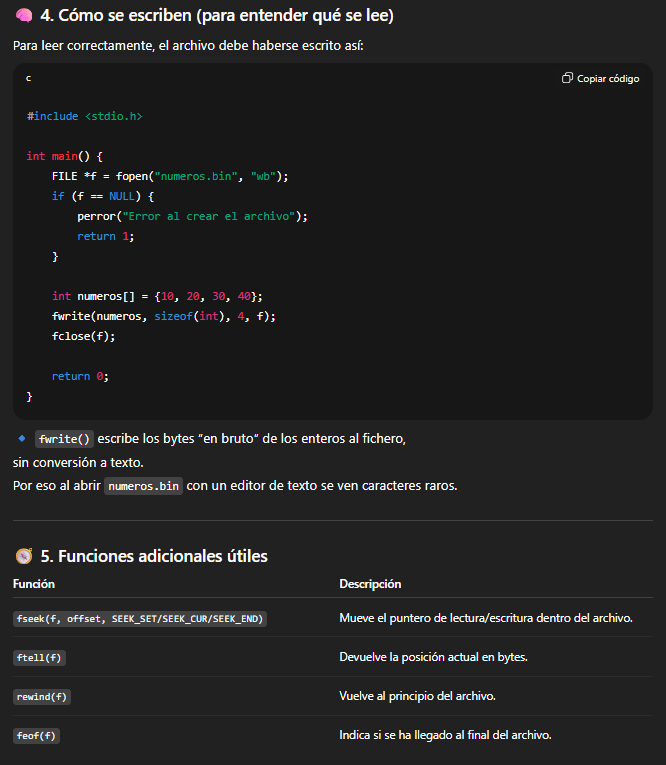
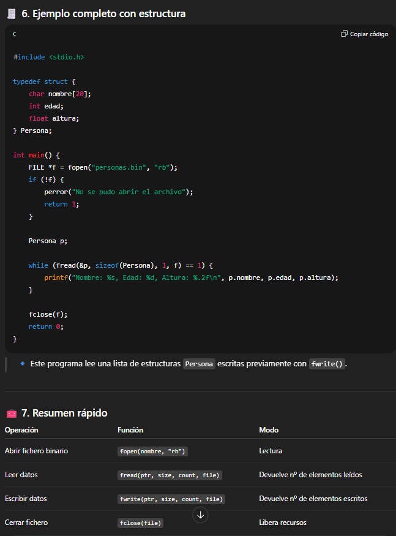
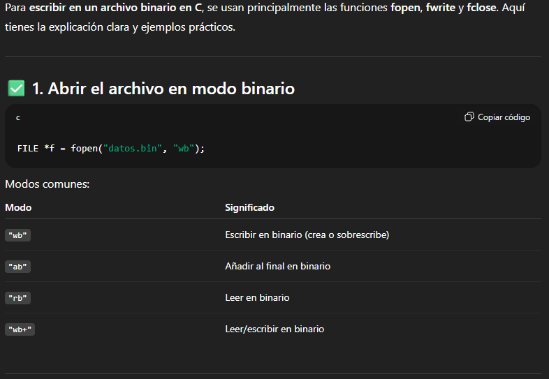
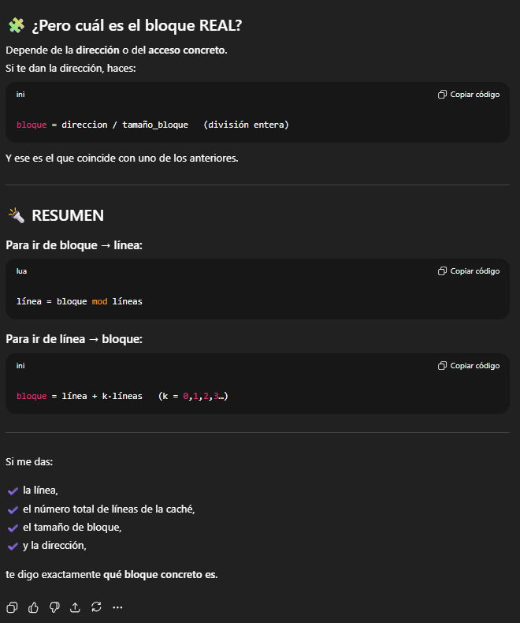

# gestion_de_memoria
[+] Integrantes del grupo:
bl1izee -> Pablo Martín Martín\
Hugok556 -> Hugo Cobos Gutiérrez

[+] Promp 1\

[+] Respuesta\

[+] Aprendizaje\
Para leer archivos binarios, hay que hacer uso en el fopen de otros keywords como rb (read binary). También hemos aprendido el buen uso de fread().

[+] Promp 2\

[+] Respuesta\

[+] Aprendizaje\
Hemos aprendido el como poder escribir en archivos binarios ya que no lo vimos en clase.
